# DCS World Dedicated Server Linux

[Useful reddit thread, used to build this guide](https://old.reddit.com/r/hoggit/comments/ns6g7j/you_can_run_dedicated_server_on_linux_here_is_how/)

Runs on a virtual desktop docker container accessed via webui/vnc (or ssh/xrdp if you wanna set that up)
~150GB of space required for the container and the game files


## 1. Clone repo
    
```bash
git clone
cd dcs-dedicated-server
```

## 2. Edit the docker-compose.yml

```yaml
environment:
    - USER=dcsuser # if you change this you will need to change the volume mount
    - PASSWORD=yourpassword # change this
    - VNC_PASSWORD=yourpassword # change this
```

## 3. Build and Run the container
#### *this will take a while*

```bash
docker-compose up -d --build
```

## 4. Gain access to remote desktop

```yaml
      - 16612:80 # access port 16612 on the host for webvnc (password in docker-compose)
      # ...
      - 16613:5900 # or use an actual vnc client (password in docker-compose)
```


## 5. Install DCS World Dedicated Server
### Open Lutris
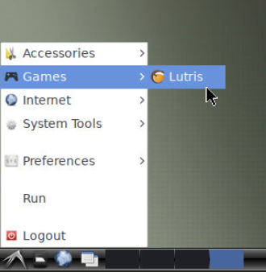

### Add Game, then Search Lutris Website for Installers
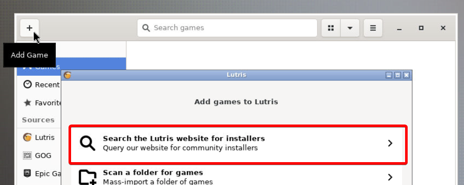

### Search for DCS World Open Beta Dedicated Server
#### *(You can choose to run the stable version in the next step)*
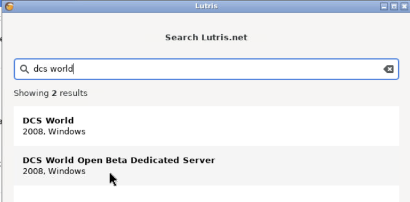

### Select desired version of DCS World Dedicated Server
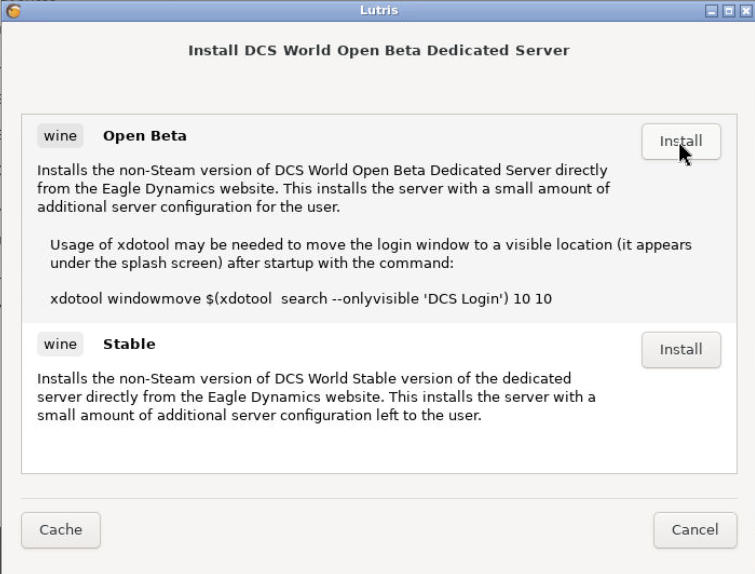

### Install, following directions
#### *this will take a while*
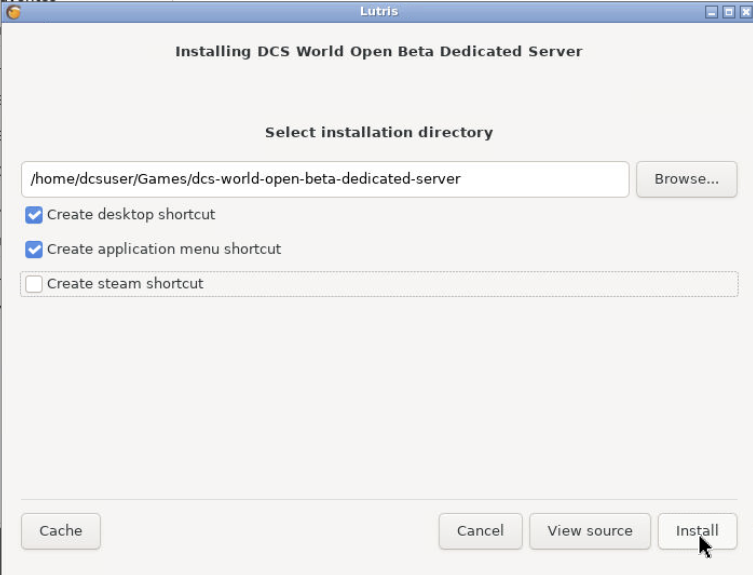

#### *defaults*
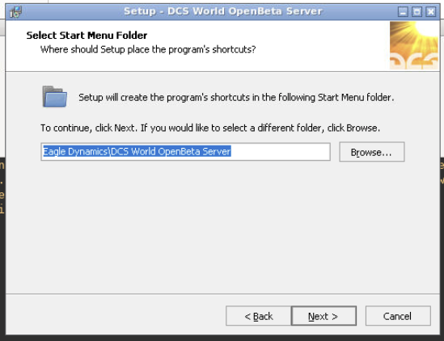


## 6. Download/Update DCS Game Data
#### The server will prompt you to download about 60Gb of game data. Similarly to the game, these files will need to be periodically updated.
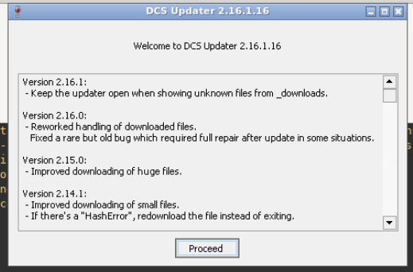

#### *this will take a while*
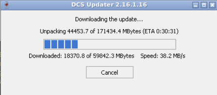


## 6. Launch DCS World Dedicated Server
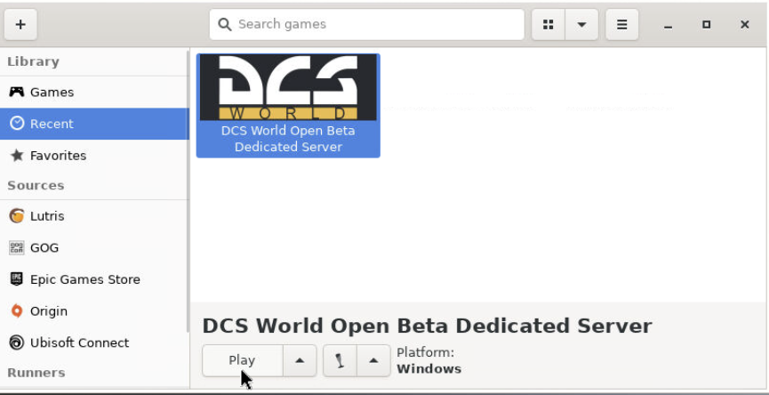


## 7. Log In
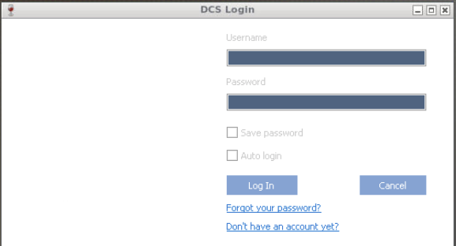

#### If you get a black window and no login prompt, use this command (in a terminal on the container) to move the login window to a visible portion of the screen
```bash
xdotool windowmove $(xdotool search --onlyvisible 'DCS Login') 10 10
```
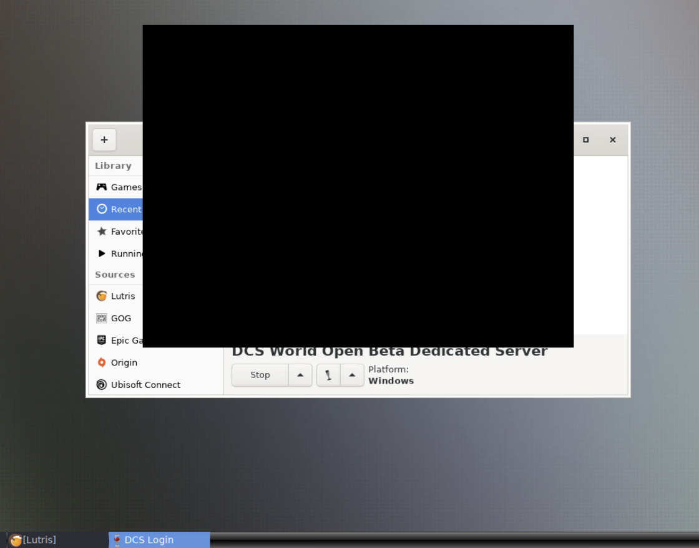


#### Once you see this window (the black screen is normal, and will persist), the server is running.
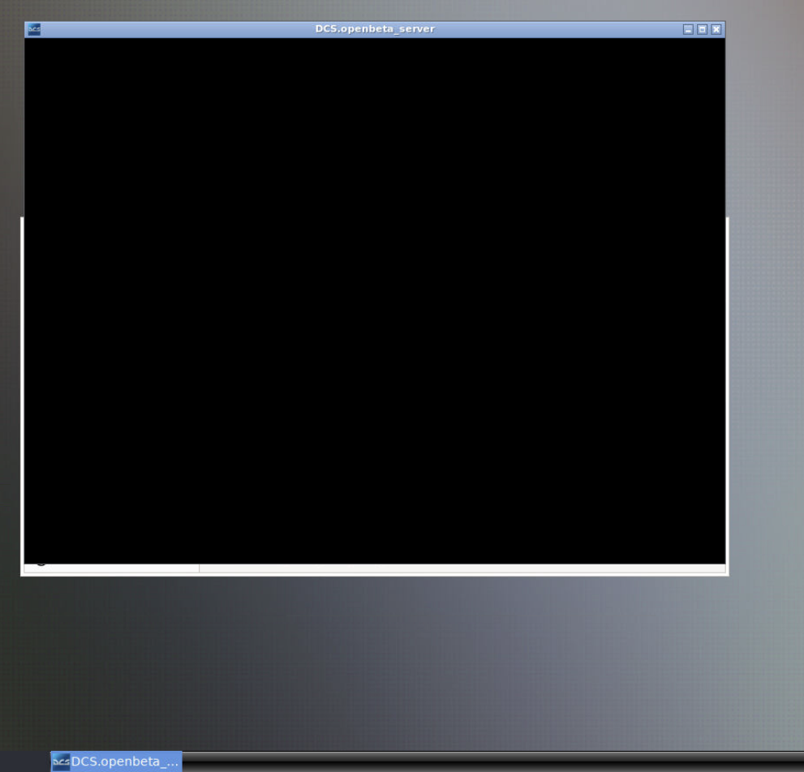


## 8. Access Server Control Webui

The DCS Server control WebUI tries to connect to the server on localhost, so it must be either accessed within the container or you must forward the control port to the machine opening the webui. 


#### Navigate to ```/home/dcsuser/Games/dcs-world-open-beta-dedicated-server/dosdevices/c:/Program Files/Eagle Dynamics/DCS World OpenBeta Server/WebGUI``` within the container, and open index.html to access the DCS Server WebUI.
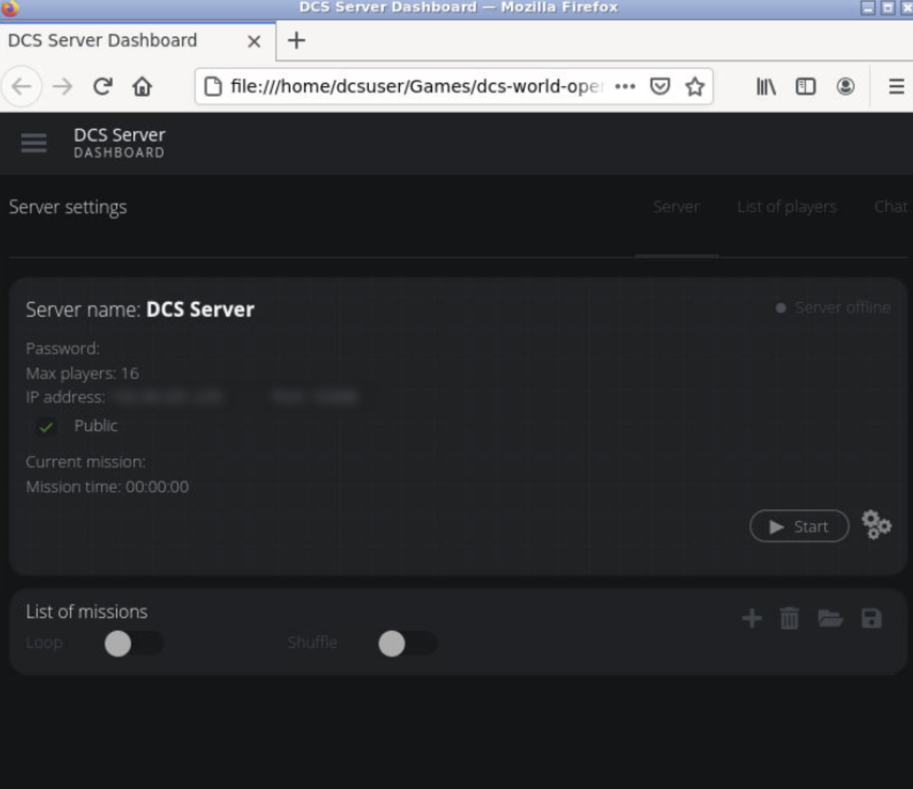